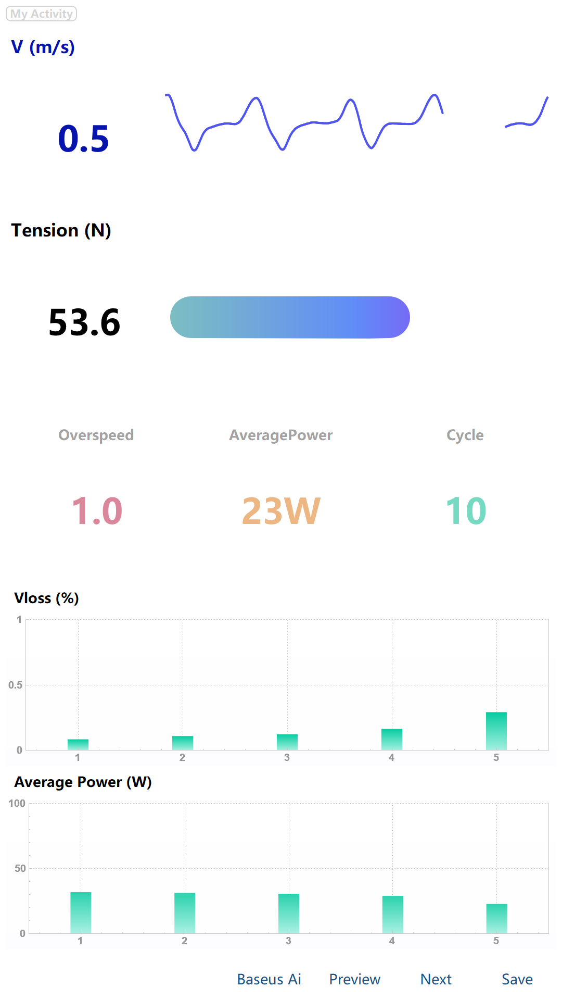
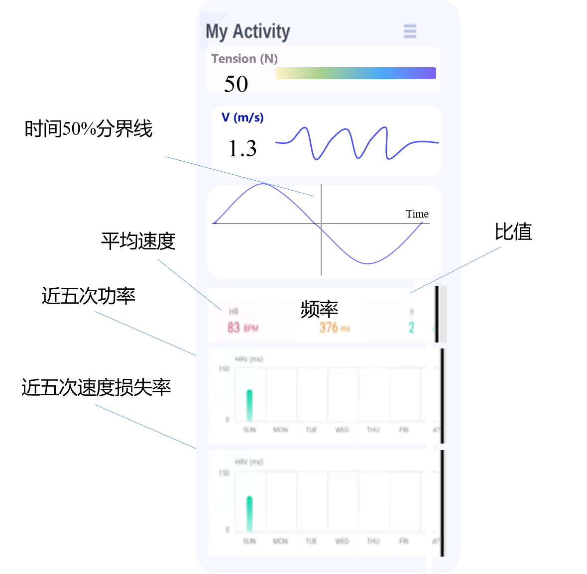
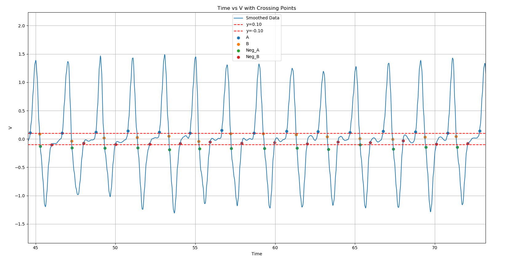
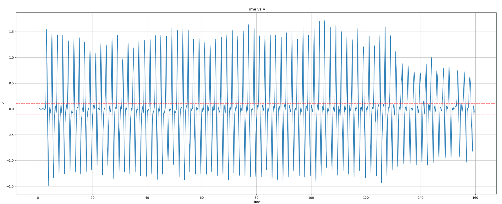

# 智能弹力带 - 可视化分析软件 - 开发文档

---

## 项目资料

---

## 总需求

* [x] 实时数据分析显示 (100%)
* [x] 读取文件分析显示 (100%)

---

## 参考资料

---

## 版本备份

### 2025/01/10

完成弹力带 - 手机界面版本初步改版

Ele_Band_static_phone_20250110(手机界面初步改版成功)

---

### 2024/11/13

完成静态数据备份
Ele_Band_static_time_20241113backup  （未添加平均功率计算  /  拉伸次数计数版本）

完成动态分析备份
Ele_Band_dynamic_20241113  （未修改正负速度阈值+-0.1版本）

---

## 工作记录

### 2025/01/20 - 开发随笔

遇到的问题：

- [x] 蓝牙在连接的时候会有多帧数据同时传输过来，造成数据堵塞的现象，此时会导致时间戳并不准确，

  

---

### 2025/01/10 - 开发随笔

更新最新的弹力带保存功能，保存原始的电阻数据与数据保存的时间，并加时间戳

关于时间戳的思考：

1.如果不加时间戳，在后续调用的时候，由于采用固定的频率送入数据，容易导致时间偏移

2.如果加时间戳，会导致每次读取数据需要花费一定的时间来保存数据

3.时间戳格式，年月日？

从时间戳的调用引入全局变量的思考：

在C语言编程中，我经常会使用全局变量，这样会使得程序变得简单，但是引入的弊端就是程序难以解耦

---

### 2025/01/10 - 开发随笔

已经初步完成手机显示界面，下一步计划是添加会议说的拉力周期

---

### 2024/12/12 - 开发随笔

对于速度损失率和疲劳程度，该软件有两种不同的设计方案

速度损失率由于需要一个控件进行实时刷新，所以采用在QWidget中加paintevent方法实现

疲劳程度仅需要图片变化即可，采用Qlabel设置不同的图片进行实现

---

### 2024/11/19

* [x] 整体ui设计界面修改：完成统计信息区域UI界面设计，增加速度损失率柱状图、平均功率折线图
  
---

### 2024/12/29

* [x] qt界面修改：修改柱状图部分，改为白色背景界面
  
---

### 2024/10/29

彻底修复C++工程和python工程输出结果不一致的问题

问题原因：C++工程遗留bug，在计算速度的时候没有乘系数，在后期UI显示的时候才乘了系数，导致设置的0.1阈值不对

*解决方法*-> 在计算速度的时候就乘以系数，整体逻辑按照python进行修复

---

###  2024/10/28

针对上面的问题，进一步对负速度计算阈值进行优化，将负速度间隔像正速度间隔计算一样，添加-0.1阈值

部分解耦了速度损失率计算与超速计算，但是二者之间仍存在耦合关系（超速计算同时需要正速度波形间隔与负波形间隔）

*解决方法*-> (20241028添加：负穿越点阈值(-0.1以及防抖动阈值30)

---

###  2024/10/27

修复弹力带数据读取功能，在水下数据中无法正确计算速度损失率的问题

问题原理：如下图，速度数据在穿越X轴（y=0）时候，会在0值附近上下抖动，造成无法正确计算速度损失率

*解决方法* -> (20241027添加：正穿越点阈值(+0.1以及防抖动阈值30)

---

###  2024/08/24

* [x] ~~实现基本的波形显示、与前端数据采集设备完成蓝牙通信~~

  

---

###  2024/09/29

* [x] ~~实现超速预警，图标（灰-橙）变化~~
* [x] ~~实现运动疲劳预警，图标（灰-橙-红) 变化~~

---

###  2024/09/17

* [x] ~~完成电阻-力的公式解算，并实现力的波形绘制~~

---

###  2024/09/12

* [x] ~~完成速度滤波（主要通过平滑滤波对数据取出数据噪点）~~

---

